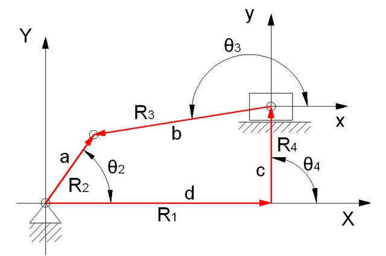

# Slider Crank Mechanism



---

A slider-crank mechanism is a four-link system (crank, connecting rod, slider, and frame) that converts rotary motion into reciprocating linear motion, or vice versa.

---

## Vector Loop Equation

```{math}
\mathbf{f} = \mathbf{R}_1 + \mathbf{R}_4 + \mathbf{R}_3 - \mathbf{R}_2 = \mathbf{0}
```

In scalar form:

```{math}
\begin{aligned}
f_x &= R_1\cos(\theta_1) - R_2\cos(\theta_2) + R_3\cos(\theta_3) + R_4\cos(\theta_4), \\
f_y &= R_1\sin(\theta_1) - R_2\sin(\theta_2) + R_3\sin(\theta_3) + R_4\sin(\theta_4).
\end{aligned}
```

## Linearization (First-Order Taylor Expansion)

Let the unknowns be $R_3$ and $\theta_4$. Around an initial guess $(R_3^{\circ}, \theta_4^{\circ})$:

```{math}
\begin{aligned}

f_x^1(R_3,\theta_4)
&\approx f_x^1(R_3^{\circ},\theta_4^{\circ})
+ \frac{\partial f_x^1}{\partial R_3}(R_3^{\circ},\theta_4^{\circ})(R_3-R_3^{\circ})
+ \frac{\partial f_x^1}{\partial \theta_4}(R_3^{\circ},\theta_4^{\circ})(\theta_4-\theta_4^{\circ}), \\
f_y^1(R_3,\theta_4)
&\approx f_y^1(R_3^{\circ},\theta_4^{\circ})
+ \frac{\partial f_y^1}{\partial R_3}(R_3^{\circ},\theta_4^{\circ})(R_3-R_3^{\circ})
+ \frac{\partial f_y^1}{\partial \theta_4}(R_3^{\circ},\theta_4^{\circ})(\theta_4-\theta_4^{\circ}).

\end{aligned}
```

Define the increments:

```{math}
\Delta R_3 = R_3 - R_3^{\circ}, \qquad
\Delta \theta_4 = \theta_4 - \theta_4^{\circ}.
```

Then:

```{math}
\begin{aligned}

f_x^1 &= R_1\cos(\theta_1) - R_2\cos(\theta_2) + R_3\cos(\theta_3) + R_4\cos(\theta_4)
+ \cos(\theta_3)\,\Delta R_3 - R_4\sin(\theta_4)\,\Delta\theta_4 = 0, \\
f_y^1 &= R_1\sin(\theta_1) - R_2\sin(\theta_2) + R_3\sin(\theta_3) + R_4\sin(\theta_4)
+ \sin(\theta_3)\,\Delta R_3 + R_4\cos(\theta_4)\,\Delta\theta_4 = 0.

\end{aligned}
```

## Matrix Form

```{math}
\begin{aligned}
A\,\Delta q &= b, \\
A &=
\begin{bmatrix}
\cos(\theta_3) & -R_4\sin(\theta_4) \\
\sin(\theta_3) & \phantom{-}R_4\cos(\theta_4)
\end{bmatrix}, \\
\Delta q &=
\begin{bmatrix}
\Delta R_3 \\
\Delta\theta_4
\end{bmatrix}, \\
b &=
\begin{bmatrix}
-R_1\cos(\theta_1)+R_2\cos(\theta_2)-R_3\cos(\theta_3)-R_4\cos(\theta_4) \\
-R_1\sin(\theta_1)+R_2\sin(\theta_2)-R_3\sin(\theta_3)-R_4\sin(\theta_4)
\end{bmatrix}.
\end{aligned}
```

## Numerical Substitution Example

Given:

```{math}
R_1 = 0.18\,\text{m}, \quad R_2 = 0.12\,\text{m}, \quad R_4 = 0.16\,\text{m},
\quad \theta_1 = 0^\circ, \quad \theta_2 = 60^\circ, \quad \theta_3 = 210^\circ.
```

Substitute into $A\,\Delta q = b$:

```{math}
\begin{aligned}
\begin{bmatrix}
\cos(210^\circ) & -0.16\sin(\theta_4) \\
\sin(210^\circ) & \phantom{-}0.16\cos(\theta_4)
\end{bmatrix}
\begin{bmatrix}
\Delta R_3 \\
\Delta\theta_4
\end{bmatrix}
=
\begin{bmatrix}
-0.18\cos(0^\circ)+0.12\cos(60^\circ)-R_3\cos(210^\circ)-0.16\cos(\theta_4) \\
-0.18\sin(0^\circ)+0.12\sin(60^\circ)-R_3\sin(210^\circ)-0.16\sin(\theta_4)
\end{bmatrix}.
\end{aligned}
```
